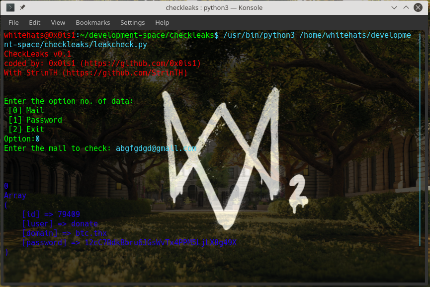

# CheckLeaks

[](https://travis-ci.com/StrinTH/checkleaks) 

[](https://app.fossa.com/projects/git%2Bgithub.com%2FStrinTH%2Fcheckleaks?ref=badge_shield)
[](https://saythanks.io/to/0x0is1off@gmail.com)

### Tool for checking data leaks of social media platforms

#### NOTE:

```sh
    Note: This tool does not work anymore as the provider onion site pwndb is not active anymore. ARCHIVING..
```

### ***Sample Preview***
[](./assets/preview.png)

# Installation
## Linux:

```sh

$ git clone https://github.com/StrinTH/checkleaks
$ cd checkleaks
$ pip install -r requirements.txt
$ python3 leakcheck.py

```
## Windows:

```sh
> same as linux
```


### **Support authors**:

[](https://www.buymeacoffee.com/6dciIwk)

[](https://paypal.me/0x0is1?locale.x=en_GB)


## Contributing

Please read [CONTRIBUTING.md](CONTRIBUTING.md) for details on our [code of conduct](CODE_OF_CONDUCT.md) and the process of submitting pull requests to us.

## License 
[](https://github.com/StrinTH/checkleaks/blob/master/LICENSE)

This project is licensed under the MIT License - see the [LICENSE](LICENSE) file for details

[](https://app.fossa.io/projects/git%2Bgithub.com%2FStrinTH%2Fcheckleaks?ref=badge_large)

<a href="NOTICE.md">Notice</a>
